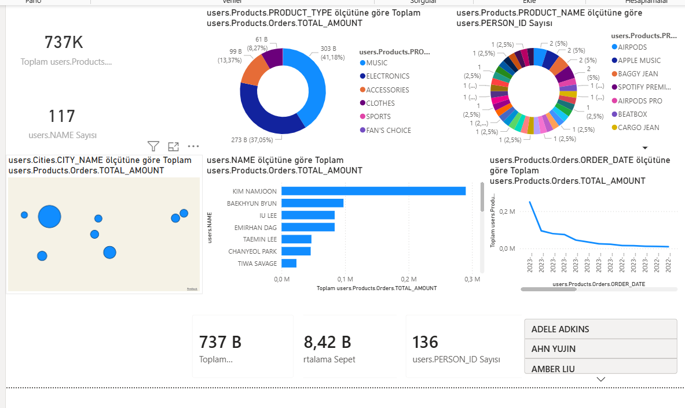

# 📊 Complex JSON Data Analysis with Power BI

Bu proje, iç içe geçmiş (Nested) karmaşık JSON veri yapılarının Power BI üzerinde işlenmesi (ETL), modellenmesi ve görselleştirilmesini amaçlamaktadır.

## 🎯 Proje Amacı
Modern web ve mobil uygulamalardan gelen hiyerarşik JSON verilerini (Kişi -> Şehir -> Ürün -> Sipariş) düzleştirerek (Flattening) analitik raporlara dönüştürmek.

## 🛠 Teknik Süreçler (ETL)
* **Power Query:** JSON formatındaki `List` ve `Record` yapıları ayrıştırıldı.
* **Data Modeling:** İç içe olan 4 farklı katman tek bir analitik tablo haline getirildi.
* **Data Type Handling:** Metin olarak gelen sayısal veriler temizlendi ve doğru formatlara dönüştürüldü.

## 📈 Dashboard Analizleri
* **KPI Takibi:** Toplam Ciro ve Benzersiz Müşteri Sayısı kartları.
* **Kategori Analizi:** Ürün tiplerine göre harcama dağılımı (Halka Grafik).
* **Coğrafi Analiz:** Ülke ve şehir bazlı satış haritası.
* **Trend Analizi:** Zaman çizelgesi üzerinde satış hareketliliği.
* **DAX:** `AVERAGE` fonksiyonu ile "Ortalama Sepet Tutarı" hesaplaması.

## 📸 Dashboard Önizleme

