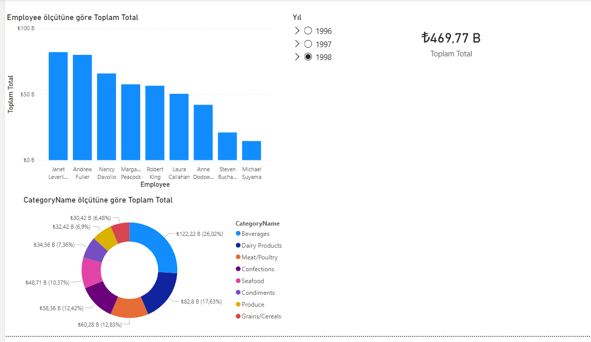
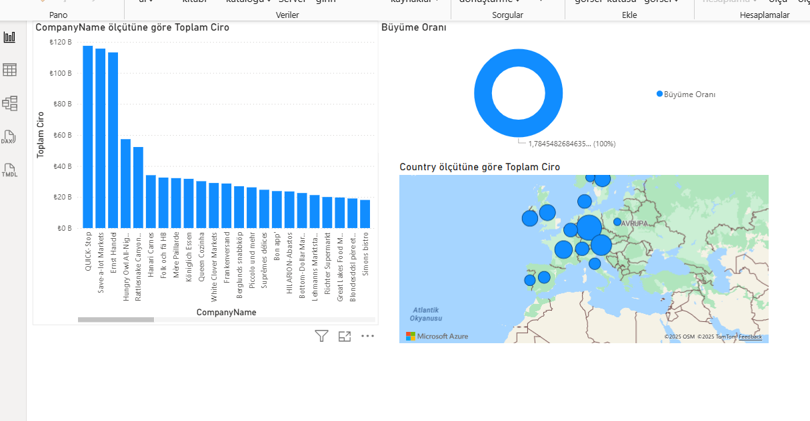

# 🚀 Northwind End-to-End Data Analytics Project

Bu proje, operasyonel veritabanı yönetimi, Python ile veri mühendisliği ve Power BI ile iş zekası süreçlerini kapsayan uçtan uca (Full-Stack) bir veri çalışmasıdır.

## 🏗 Mimari
SQL Server (Backend) ➔ Python (ETL & Analysis) ➔ Power BI (Visualization)

## 🛠 Kullanılan Teknolojiler
 Veritabanı MS SQL Server (T-SQL)
 Programlama Python (Pandas, SQLAlchemy, Matplotlib)
 BI & Raporlama Power BI (DAX, Star Schema)

## 🔥 Temel Özellikler

### 1. SQL Veritabanı Geliştirme
 Data Integrity `Trigger` kullanılarak silinen siparişler ve fiyat değişimleri için Audit (Log) mekanizması kuruldu.
 Automation `Stored Procedure` ve `Transaction` yapıları ile veri tutarlılığı garanti altına alındı.
 Performance Sorgu maliyetleri (Query Cost) analiz edilerek `Index` optimizasyonu yapıldı.

### 2. Python Entegrasyonu
 SQL Server'dan veriler `SQLAlchemy` ile çekildi.
 Pandas kullanılarak Stok Risk Analizi yapıldı ve sonuçlar SQL'e yeni bir tablo olarak geri yazıldı (Write-Back).
 Otomatik raporlama botu ile günlük stok grafikleri `.png` olarak dışa aktarıldı.

### 3. Power BI Görselleştirme
 Ham tablolar yerine Star Schema mimarisi kuruldu.
 DAX ile Time Intelligence (Geçen Yılın Cirosu, Büyüme Oranı) metrikleri hesaplandı.
 Drill-through özellikli interaktif dashboard tasarlandı.

## 📸 Ekran Görüntüleri

